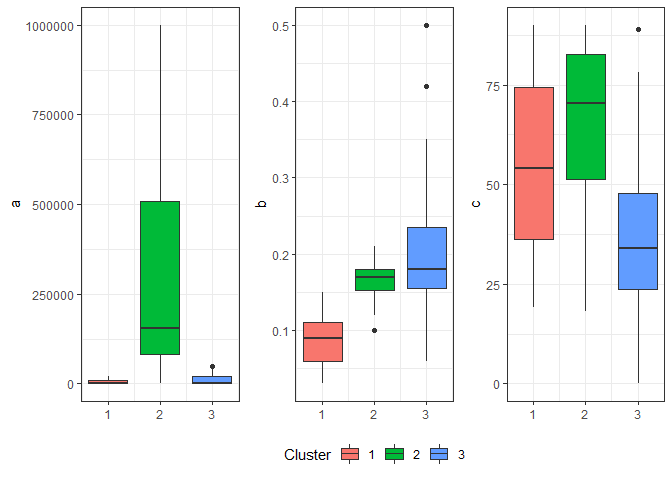

task-2
================
Ngoc Duong
4/23/2020

Load curves.Rdata

``` r
load("./curves.RData")
```

``` r
#fake data 
set.seed(123123)
Sigma1 = matrix(c(1, 0.5, 0.5,0.5,1,0.5,0.5, 0.5,1), ncol = 3, nrow = 3)
x1 = mvrnorm(n = 100, mu = c(0 ,0, 0), Sigma1)
Sigma2 = matrix(c(2, 0.5, 0.5,0.5,2,0.5,0.5, 0.5,2), ncol = 3, nrow = 3)
x2 = mvrnorm(n = 100, mu = c(1, 3, 2), Sigma2)
Sigma3 = matrix(c(3, 0.5, 0.5,0.5,3,0.5,0.5, 0.5,3), ncol = 3, nrow = 3)
x3 = mvrnorm(n = 100, mu = c(4 ,1, -2), Sigma3)
data =  rbind(x1, x2, x3)
#standardize data
standardize = function(col) {
  mean = mean(col)
  stdev = sd(col)
  return((col - mean)/stdev)
}
data = as_tibble(data) %>% map_df(.x = ., standardize)
```

    ## Warning: `as_tibble.matrix()` requires a matrix with column names or a `.name_repair` argument. Using compatibility `.name_repair`.
    ## This warning is displayed once per session.

**K-means** For each data point x, compute d, the distance between x and
the nearest center that has already been chosen. Choose one new data
point at random as a new center, using a weighted probability
distribution where a point x is chosen with probability proportional to
d^2 Repeat steps 2 and 3 until k centers have been
chosen.

``` r
#partition of data such that squared error between empirical mean and points in each cluster/partition is minimized
km_func <- function(data, k){
  p <- ncol(data)  # number of parameters
  n <- nrow(data)  # number of observations
  diff = 1
  iter = 0
  itermax = 50
  while(diff > 1e-4 && iter <= itermax){
    #initial centroids
    if(iter == 0){
      centroid = data[sample(nrow(data), k),]
      centroid_mem = centroid
    }

    #assign to cluster 
    d = sapply(1:k, function(c) sapply(1:n, function(i) {sum((centroid[c,] - data[i,])^2)}))
    
    cluster = apply(d, 1, which.min)
    
    #recalculate cluster 
    centroid = t(sapply(1:k, 
                         function(c) {apply(data[cluster == c,], 2, mean)}
                         ))
    
    #recalculate distance
    diff = sum((centroid - centroid_mem)^2)
    iter = iter + 1 
    centroid_mem = centroid
  }
  return(list(centroid = centroid, cluster = cluster))
}
```

``` r
#test on simulated data 
set.seed(3)
km_sim <- km_func(data, 3)
colnames(data) = c("a","b","c")
data_new = cbind(data, cluster = km_sim$cluster)


#crosstab with true underlying distribution
data_true = data %>% mutate(cluster = c(rep(1,100),rep(2,100),rep(3,100)))

#check misclassification 
table(km_sim$cluster,data_true$cluster) %>% knitr::kable()
```

|  1 |  2 |  3 |
| -: | -: | -: |
|  0 |  1 | 85 |
| 96 | 22 |  9 |
|  4 | 77 |  6 |

Misclassification is not too high, reason for misclassification is
likely due to MVN RV’s are actually kind of close to each
other.

``` r
plot_ly(x=data_new[,1], y=data_new[,2], z=data_new[,3], type="scatter3d", mode="markers", color = data_new[,4])
```

Run k-means algorithm on estimated parameters

``` r
#import data
param_df = param_df1 %>% as.data.frame()

#standardize data
param_names = c("a_std","b_std","c_std")
param_standard = NULL
for (i in 2:4) {
col = (param_df[,i] - mean(param_df[,i]))/sd(param_df[,i])
param_standard = cbind(param_standard, col)
}
colnames(param_standard) = param_names
param_both = cbind(param_standard, param_df)

#apply K-means to param estimates data
km_2 <- km_func(param_standard, 2)
km_3 <- km_func(param_standard, 3)
km_4 <- km_func(param_standard, 4)
km_5 <- km_func(param_standard, 5)

#prepare final k-means data 
param_km2_final = cbind(param_both, cluster = km_2$cluster) %>%
  group_by(cluster) %>% arrange(desc(cluster))

param_km3_final = cbind(param_both, cluster = km_3$cluster) %>%
  group_by(cluster) %>% arrange(desc(cluster))

param_km4_final = cbind(param_both, cluster = km_4$cluster) %>%
  group_by(cluster) %>% arrange(desc(cluster))

param_km5_final = cbind(param_both, cluster = km_5$cluster) %>%
  group_by(cluster) %>% arrange(desc(cluster))
```

``` r
#plot on standardized data
plot_ly(x=param_km3_final$a_std, y=param_km3_final$b_std, z=param_km3_final$c_std, 
        type="scatter3d", mode="markers", color = param_km3_final$cluster)

#visualize on original data - 2 clusters
plot_ly(x=param_km2_final$a, y=param_km2_final$b, z=param_km2_final$c, 
        type="scatter3d", mode="markers", color = param_km2_final$cluster)

#visualize on original data - 3 clusters
plot_ly(x=param_km3_final$a, y=param_km3_final$b, z=param_km3_final$c, 
        type="scatter3d", mode="markers", color = param_km3_final$cluster)

#visualize on original data - 4 clusters
plot_ly(x=param_km4_final$a, y=param_km4_final$b, z=param_km4_final$c, 
        type="scatter3d", mode="markers", color = param_km4_final$cluster)

#visualize on original data - 5 clusters
plot_ly(x=param_km5_final$a, y=param_km5_final$b, z=param_km5_final$c, 
        type="scatter3d", mode="markers", color = param_km5_final$cluster)
```

Summary table for kmeans clustering results

``` r
param_km3_final %>% group_by(cluster) %>% 
  summarise(a_mean = mean(a),
            b_mean = mean(b),
            c_mean = mean(c),
            a_max = max(a),
            b_max = max(b),
            c_max = max(c),
            a_min = min(a),
            b_min = min(b),
            c_min = min(c)) %>% 
  knitr::kable()
```

| cluster |    a\_mean |   b\_mean |  c\_mean |  a\_max | b\_max |   c\_max | a\_min | b\_min |     c\_min |
| ------: | ---------: | --------: | -------: | ------: | -----: | -------: | -----: | -----: | ---------: |
|       1 | 198895.455 | 0.2609091 | 39.61083 | 1000000 |   0.50 | 89.79950 |    100 |   0.17 |  5.9623879 |
|       2 |  24196.053 | 0.0815789 | 73.55159 |  610000 |   0.18 | 89.99994 |    100 |   0.03 | 51.0419683 |
|       3 |   7970.455 | 0.1261364 | 35.22784 |  110000 |   0.22 | 61.16436 |    100 |   0.06 |  0.0000783 |

``` r
param_km4_final %>% group_by(cluster) %>% 
  summarise(a_mean = mean(a),
            b_mean = mean(b),
            c_mean = mean(c),
            a_max = max(a),
            b_max = max(b),
            c_max = max(c),
            a_min = min(a),
            b_min = min(b),
            c_min = min(c)) %>% 
  knitr::kable()
```

| cluster |    a\_mean |   b\_mean |  c\_mean |  a\_max | b\_max |   c\_max | a\_min | b\_min |     c\_min |
| ------: | ---------: | --------: | -------: | ------: | -----: | -------: | -----: | -----: | ---------: |
|       1 | 892000.000 | 0.1660000 | 75.29464 | 1000000 |   0.20 | 89.91041 | 610000 |   0.10 | 43.8412506 |
|       2 |   8826.316 | 0.2778947 | 27.14341 |   80000 |   0.50 | 57.45403 |    100 |   0.20 |  5.9623879 |
|       3 |  12267.045 | 0.1231818 | 36.44250 |  200000 |   0.20 | 61.16436 |    100 |   0.06 |  0.0000783 |
|       4 |  16335.135 | 0.0822973 | 73.81448 |  210000 |   0.19 | 89.99994 |    100 |   0.03 | 51.2673241 |

Grouped boxplots of a, b, and c for 3 clusters (k = 3)

``` r
a = param_km3_final %>% group_by(cluster) %>% 
  ggplot(aes(x = cluster, y = a, fill = factor(cluster))) +
  geom_boxplot() + theme_bw() + 
  theme(legend.position = "none", axis.title.x=element_blank()) 

b = param_km3_final %>% group_by(cluster) %>% 
  ggplot(aes(x = cluster, y = b, fill = factor(cluster))) +
  geom_boxplot() + theme_bw() + labs(fill = "Cluster") + 
  theme(legend.position = "bottom", axis.title.x=element_blank())
  
c = param_km3_final %>% group_by(cluster) %>% 
  ggplot(aes(x = cluster, y = c, fill = factor(cluster))) +
  geom_boxplot() + theme_bw() + 
  theme(legend.position = "none", axis.title.x=element_blank())

a+b+c
```

<!-- -->

**EM algorithm for Gaussian mixtures**

``` r
gmm_func <- function(X, k){
  #setting
  data <- as.matrix(X) 
  #%>% scale()
  N <- nrow(data)
  q <- ncol(data)
  p_j <- rep(1/k, k)
  mu <-  data[sample(N, k),] %>% as.matrix()   
  covmat <- diag(ncol(data))
  
  covList <- list()
  for(i in 1:k){
    covList[[i]] <- covmat
  }
 
  count=1
  while(count <100){
    mu0 <- mu
    
    # E-step: Evaluate posterior probability, gamma
    gamma <- c()
    for(j in 1:k){
      gamma2 <- apply(data,1, mvtnorm::dmvnorm, mu[j,], covList[[j]])
      gamma <- cbind(gamma, gamma2)
    }
    
    # M- step: Calculate mu
    tempmat <- matrix(rep(p_j,N),nrow=N,byrow = T)
    r <- (gamma * tempmat) / rowSums(gamma*tempmat)  
    mu <- t(r) %*% data / colSums(r) 
    
    # M- step: Calculate Sigma and p
    for(j in 1:k){
      sigma <- matrix(rep(0,q^2),ncol=q)
      for(i in 1:N){
        sigma = sigma + r[i,j] * (data[i,]-mu0[j,]) %*% t(data[i,]-mu0[j,])   
      }
      covList[[j]] <- sigma/sum(r[,j])
    }
    p_j <- colSums(r)/N
    count = count + 1
  }
  
  cluster <- which(r == apply(r, 1, max), arr.ind = T)
  cluster <- cluster[order(cluster[,1]),]
  return(list(cluster = cluster))
}
```

Test on simulated data

``` r
set.seed(3)
gmm_test = gmm_func(data, 3)
sim_data_gmm = cbind(data,gmm_test$cluster) %>% dplyr::select(-row) %>% rename(cluster = col)

#see clustering performance -- ideally 100 for each cluster
table(gmm_test$cluster[,2]) 
```

    ## 
    ##   1   2   3 
    ## 114 110  76

``` r
#check misclassification
table(gmm_test$cluster[,2],data_true$cluster)
```

    ##    
    ##      1  2  3
    ##   1  6  9 99
    ##   2 92 17  1
    ##   3  2 74  0

Some misclassification (clustered into incorrect underlying
distributions), but misclassification rate is not too high (10%) so it’s
ok

``` r
plot_ly(x=sim_data_gmm$a, y=sim_data_gmm$b, z=sim_data_gmm$c, 
        type="scatter3d", mode="markers", color = sim_data_gmm$cluster)
```

Now, we can try run GMM on estimated parameter data, picking k = 3

``` r
set.seed(3)
param_gmm <- gmm_func(param_standard, 3)

#prepare data 
param_gmm_final = cbind(param_both, cluster= param_gmm$cluster[,2]) %>%
  group_by(cluster) %>% arrange(desc(cluster))

table(param_gmm_final$cluster) %>% knitr::kable()
```

| Var1 | Freq |
| :--- | ---: |
| 1    |  121 |
| 2    |   18 |
| 3    |   47 |

``` r
param_gmm_final %>% group_by(cluster) %>% 
  summarise(a_mean = mean(a),
            b_mean = mean(b),
            c_mean = mean(c),
            a_max = max(a),
            b_max = max(b),
            c_max = max(c),
            a_min = min(a),
            b_min = min(b),
            c_min = min(c)) %>% 
  knitr::kable()
```

| cluster |    a\_mean |   b\_mean |  c\_mean | a\_max | b\_max |   c\_max | a\_min | b\_min |     c\_min |
| ------: | ---------: | --------: | -------: | -----: | -----: | -------: | -----: | -----: | ---------: |
|       1 |   3983.471 | 0.0885950 | 55.16894 |  2e+04 |   0.15 | 89.99992 |    100 |   0.03 | 19.0919134 |
|       2 | 326116.667 | 0.1644444 | 65.43959 |  1e+06 |   0.21 | 89.99994 |    100 |   0.10 | 18.1315000 |
|       3 |  11997.872 | 0.1991489 | 36.34158 |  5e+04 |   0.50 | 88.95334 |    100 |   0.06 |  0.0000783 |

Pick k = 4

``` r
set.seed(3)
param_gmm4 <- gmm_func(param_standard, 4)

#prepare data 
param_gmm4_final = cbind(param_both, cluster= param_gmm4$cluster[,2]) %>%
  group_by(cluster) %>% arrange(desc(cluster))

table(param_gmm4_final$cluster) %>% knitr::kable()
```

| Var1 | Freq |
| :--- | ---: |
| 1    |  112 |
| 2    |   16 |
| 3    |   20 |
| 4    |   38 |

``` r
param_gmm4_final %>% group_by(cluster) %>% 
  summarise(a_mean = mean(a),
            b_mean = mean(b),
            c_mean = mean(c),
            a_max = max(a),
            b_max = max(b),
            c_max = max(c),
            a_min = min(a),
            b_min = min(b),
            c_min = min(c)) %>% 
  knitr::kable()
```

| cluster |    a\_mean |   b\_mean |  c\_mean | a\_max | b\_max |   c\_max | a\_min | b\_min |     c\_min |
| ------: | ---------: | --------: | -------: | -----: | -----: | -------: | -----: | -----: | ---------: |
|       1 |   3400.893 | 0.0858036 | 55.21952 |  1e+04 |   0.13 | 89.99992 |    100 |   0.03 | 19.0919134 |
|       2 | 365631.250 | 0.1631250 | 63.57279 |  1e+06 |   0.21 | 89.99994 |    100 |   0.10 | 18.1315000 |
|       3 |  24155.000 | 0.1820000 | 47.76079 |  5e+04 |   0.50 | 88.95334 |    100 |   0.06 |  0.0000783 |
|       4 |   5313.158 | 0.1889474 | 36.95901 |  2e+04 |   0.33 | 87.12060 |    100 |   0.06 |  5.9623879 |

``` r
#plot on standardized data
plot_ly(x=param_gmm_final$a_std, y=param_gmm_final$b_std, z=param_gmm_final$c_std, 
        type="scatter3d", mode="markers", color = param_gmm_final$cluster)

#visualize on original data k =3 
plot_ly(x=param_gmm_final$a, y=param_gmm_final$b, z=param_gmm_final$c, 
        type="scatter3d", mode="markers", color = param_gmm_final$cluster)

#visualize on original data k=4
plot_ly(x=param_gmm4_final$a, y=param_gmm4_final$b, z=param_gmm4_final$c, 
        type="scatter3d", mode="markers", color = param_gmm4_final$cluster)
```

Grouped boxplots of a, b, and c for 3 clusters (k = 3)

``` r
d = param_gmm_final %>% group_by(cluster) %>% 
  ggplot(aes(x = cluster, y = a, fill = factor(cluster))) +
  geom_boxplot() + theme_bw() + 
  theme(legend.position = "none", axis.title.x=element_blank()) 

e = param_gmm_final %>% group_by(cluster) %>% 
  ggplot(aes(x = cluster, y = b, fill = factor(cluster))) +
  geom_boxplot() + theme_bw() + labs(fill = "Cluster") + 
  theme(legend.position = "bottom", axis.title.x=element_blank())
  
f = param_gmm_final %>% group_by(cluster) %>% 
  ggplot(aes(x = cluster, y = c, fill = factor(cluster))) +
  geom_boxplot() + theme_bw() + 
  theme(legend.position = "none", axis.title.x=element_blank())

d+e+f
```

<!-- -->
