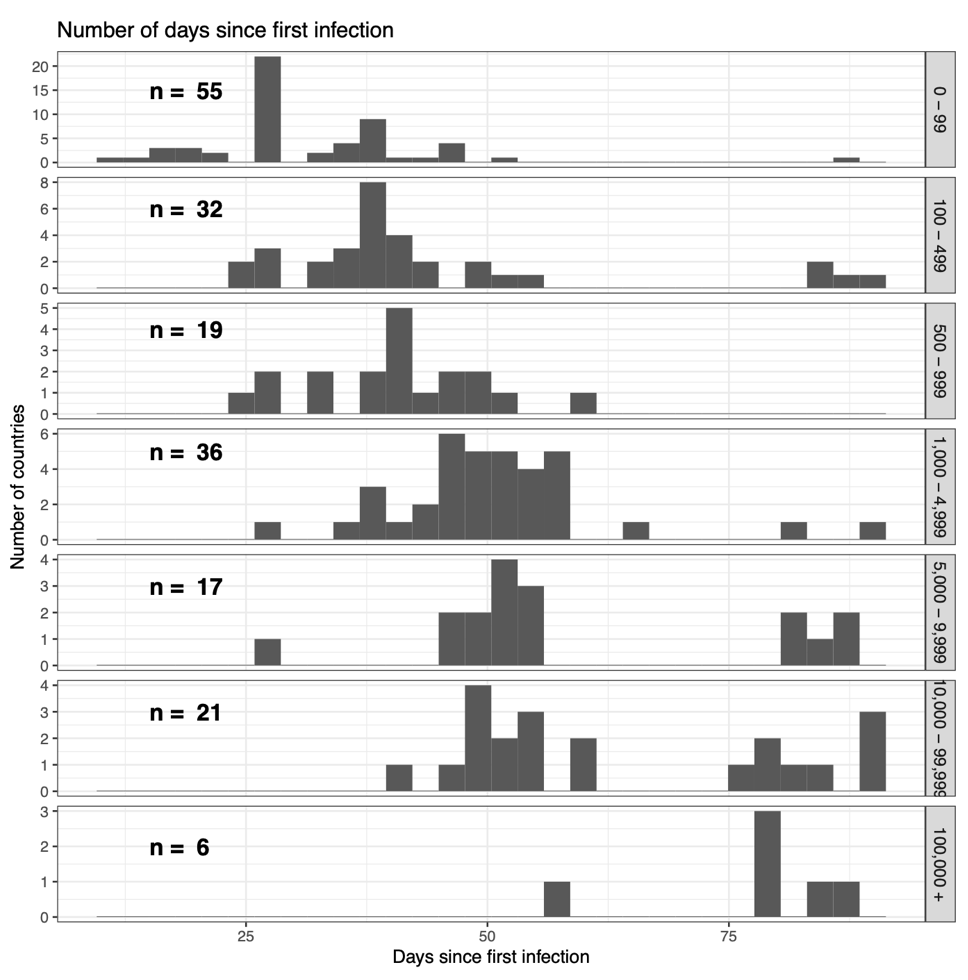
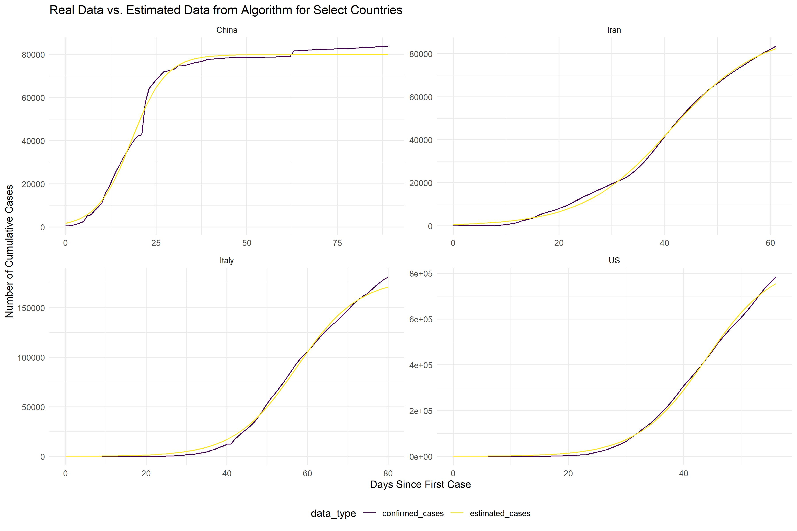
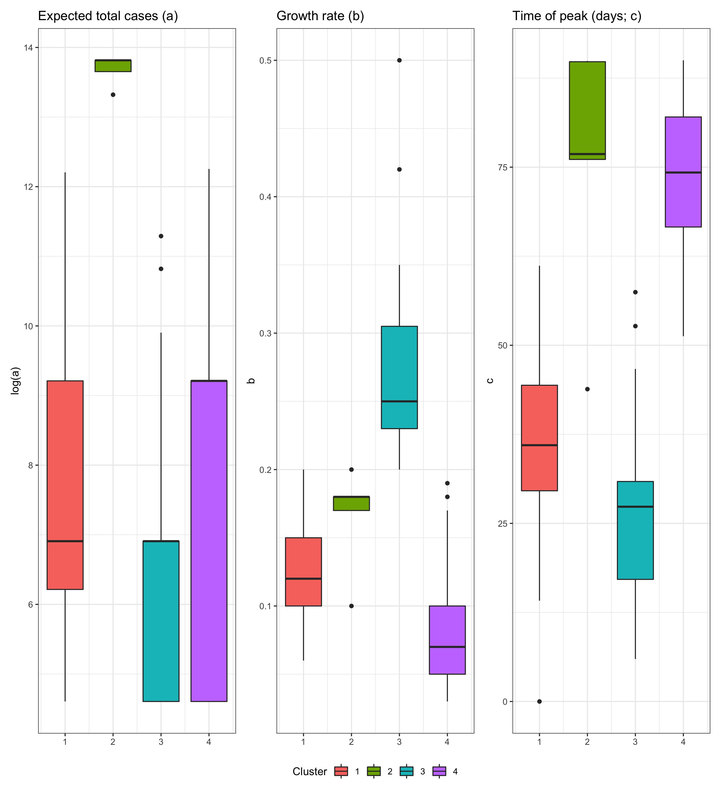
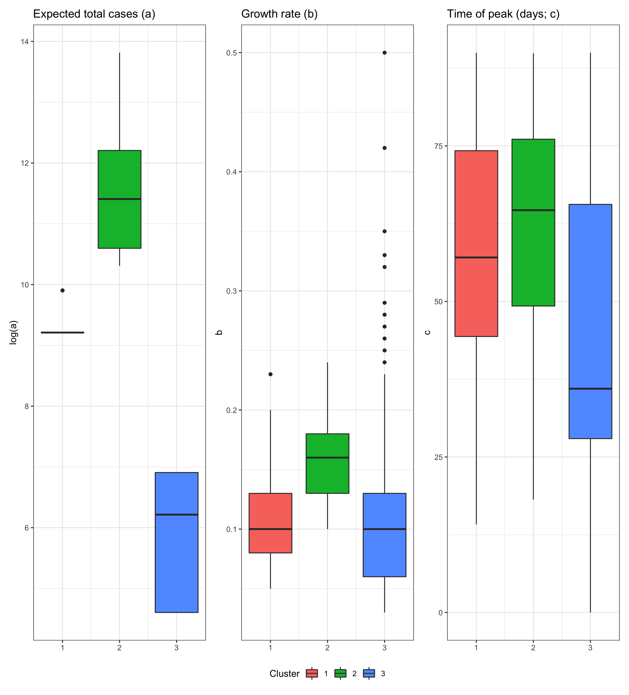
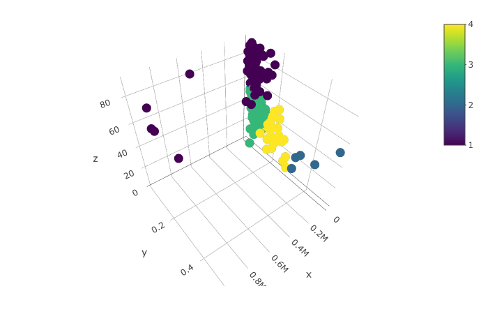
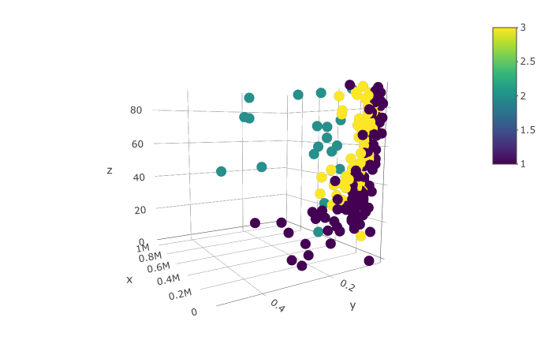

```{r setup, include=FALSE}
knitr::opts_chunk$set(echo = FALSE, warning = FALSE, message = FALSE)

library(tidyverse)
library(directlabels)
library(countrycode)

load("./curves.RData")
```

## Introduction

COVID-19 has recently caused a worldwide pandemic. While the illness began in Wuhan, China, it quickly spread to other countries, and the world saw an exponential rise in both cases and deaths. Modeling the trajectories of this growth at the community level - country, state, city, etc. - is important for influencing policy in the effort to curb this pandemic. In this project, we use an exponential model to estimate and predict country-level COVID-19 cases. We also sought to understand whether these countries can be grouped - comparing two clustering algorithms - by the features of their trajectories, and what those influencing features might be. 


## Methods

### Data

We used data from Johns Hopkins, which holds information about the daily total number of cases in a given region over a 3-month period, between January 22 and April 20. Information in the data includes the country or region, the city, latitude and longitude coordinates, and the cumulative number of confirmed cases and deaths for that day. 

We are interested primarily in the virus trajectory over time. We looked at the country level to model the cumulative number of cases over time, beginning on the day that each country reported its first COVID-19 case.


### Part 1: Fitting the models

We fit exponential models to each country in our data using coordinate-wise optimization over a pre-specified interval to minimize our loss function, defined here as the mean sum of squares (SS): $$loss = \frac{\sum_{i = 1}^{T_j} (\hat{X_i} - X_i)}{T_j}$$ for the $j^{th}$ country and $i^{th}$ time point. The exponential distribution is modeled as $$f(t) = \frac{a}{1 + exp\{-b(t - c)\}}$$, where $t$ represents the number of days since the first documented infection, $a$ is the maximum value or the curve, $b$ is the growth rate, and $c$ is the midpoint (the time at which the growth rate $b$ is highest. 

To assess the prediction ability of the country-specific models, we predicted the total number of confirmed cases for the following 8 days, from April 21-29, and looked at the RMSE of the predictions.


### Part 2: Clustering

We clustered the data with both K-means and Gaussian mixture model. For both methods, we first standardize the data as follows: 
$$\text{standardized}(x_{i}) = \frac{x_{i} - \bar{x}}{sd(x)}$$ for $i = 1,2,..., n$

**K-means**

First, we produce a set of initial centroids (sample means) $\mu_1^{(0)}, \mu_2^{(0)},...,\mu_k^{(0)}\}$. The k-means algorithm is based on that initialized setup to iterate the following two steps:

*1) Find optimal cluster assignment given fixed centroids* 

For each data point $x_i$, compute $d_i$, the Euclidean distance between $x_i$ and the centroids, then assign $x_i$ to cluster with the smallest $d_i$. This is equivalent to: 

$$r_{i,j}^{(v+1)} = I\{j=\arg\min_j \|\mathbf x_i - \mu_j^{(v)}\|\}$$

*2) Calculate cluster centers using the cluster assignment in the previous step*

This steps involves minimizing $J(r, \mu)$ over $\mu$: 

$$\mu_j^{(v+1)} =\frac{\sum_{i=1}^n\mathbf x_i r_{i,j}^{(v+1)}}{\sum_{i=1}^n r_{i,j}^{(v+1)}} $$

In other words, we update the new cluster means by taking the average of all datapoints that belong to that cluster using a weighted probability distribution where point $x_i$ is chosen. This reflects the new cluster assignments of the datapoints.

Then, we repeat these two steps until k centers have been chosen/converged.

**Gaussian mixtures**

Let $\{x_1,x_2,...,x_n\} \in R^3$ be a collection of 3-dimensional datapoints. Assuming they come from underlying Gaussian distributions, we can implement the EM algorithm to identify what distribution each points belongs to, which consists of three steps: initialization, E-step, and M-step. In short, the algorithm randomly selects k different clusters and starts with finding weights, mean, and covariance matrix for each cluster. Then, E-step can be applied on those values. These two steps are then reiteratively applied back-and-forth until centroids converge or maximum iteration threshold is reached.

*Initialization*

Gaussian mixture models assume that each latent class has different means and covariances. However, since each class is unknown, we begin by intializing the parameters and iteratively updating. Here, we chose to initialize 3 (random) different classes.

Then, we initialize a weight (posterior probability) matrix $\gamma$ with size, where each row contains the mean value for each of the three Gaussians. Then, the values for covariance matrix list, where each element in the list represents a covariance matrix for each Gaussian. Finally, we can randomly assign data to each Gaussian with the weight matrix, where each column shows the probability each point belongs to each of the three clusters.

*E-step*

In E-step, each observation is assigned a weight (responsibility) for each cluster, based on the likelihood of each of the corresponding Gaussian using the initialized parameters (means and covariance matrix and the function dmvnorm). The responsibility is defined as:

$$\hat\gamma_{i, k} ^{(t)}= P(r_{i,k}=1 |\mathbf x_i,  \theta^{(t)}) =  
\frac{p_k^{(t)}f(\mathbf x_i|\boldsymbol \mu_k^{(t)}, \Sigma_k^{(t)})}
{\sum_{j=1}^K f(\mathbf x_i|\boldsymbol \mu_j^{(t)}, \Sigma_j^{(t)})}$$

*M-step*

In the M-step, we aim to maximize the complete log-likehood function and thus revising the parameters. In this step, each observation contributes to the weighted means and covariances for every cluster. Here, the mixing component is $p_k = \frac{n_k}{n} (1)$, also a prior for each class estimated from the data. 
Let $n_k = \sum_i^n{\gamma_{ik}} (2)$, we have 
$$\mu_k = \frac{1}{m_k} \sum_i{\gamma_{ik}x_i} (3)$$, and 
$$\Sigma_k = \frac{1}{n_k} \sum_i{\gamma_{ik}(x_i – \mu_k)^T(x_i-\mu_k)} (4)$$


We start by updating the mixture components (i.e. prior probabilities). Each datapoint contributes to a $\gamma_{i,k}$ which corresponds to one column vector each class. Given the available information, using (1) and (2), we can update the prior probabilities. Following the formulas (3) and (4), we can update $\mu_k^{t+1}$ and $\Sigma_k^{t+1}$ as our new Gaussian density parameters. This process involves standard calculation of mean and variance for a Gaussian distribution. However, during this process, we also use weights $\gamma_{ik}$ and $\frac{1}{m_k}$ to weight each point in our mean and covariance estimation.

Once the likelihood has been maximized in this step, we loop back and iterate the process until a maximum is found or an iteration threshold has been reached.


## Results

### Data and model fitting

There are 186 countries in the dataset. Generally speaking, countries that were hit with the virus earlier have a higher total number of confirmed cases. Additionally, tallies suggest skewness in the total number of cases across countries; most countries are seeing under 5,000 cases (Figure 1). 

Since the midpoint milestone, the cumulative number of cases per day have been rising at a decreasing rate. There are 93 countries that are past the midpoint, or peak, of COVID-19 spread. Of these, 63 are at least a week past, 38 are at least 2 weeks past, and 3 countries (China, South Korea, and Cambodia) are at least 1 month past the peak. These latter 3 countries are definitely nearing or have reached this first wave of virus spread. 

It appears that the countries with the highest growth rate (b) have comparably low expected total number of cases. Table 1 gives this information for the top 10 largest growth rate countries, all of which have passed their midpoint. Table 2 shows the 10 countries with the smallest growth rate. Most of these have total confirmed case counts under 500, and none of them have yet reached their peak (midpoint). Twenty-five countries are nearing (within 5\%) or have already passed the end of virus spread (Table 3). There is no obvious pattern to this group of countries, although there are several that were hit by the virus early, and most of the countries are in the Eastern Hemisphere.

```{r}
summary_country_df = by_country %>% 
  rename(region = country_region) %>%
  left_join(., param_df1, by = "region")  

peak_data = summary_country_df %>% group_by(region) %>% 
  mutate(max_t = max(t)) %>% 
  dplyr::select(-t, -confirmed_cases, -fatalities) %>% 
  distinct(region, .keep_all = TRUE) 

peak_data %>% ungroup() %>% top_n(10, b) %>% 
  dplyr::arrange(desc(b)) %>%
  mutate(c = round(c, 0)) %>%
  knitr::kable(caption = "Top 10 countries with high growth rate",
               col.names = c("Country",
                             "a",
                             "b",
                             "c",
                             "Days obs. since first infection (t)"))

peak_data %>% ungroup() %>% top_n(-10, b) %>% 
  dplyr::arrange(b) %>%
  mutate(c = round(c, 0)) %>%
  knitr::kable(caption = "Top 10 countries with low growth rate",
               col.names = c("Country",
                             "a",
                             "b",
                             "c",
                             "Days obs. since first infection (t)"))


summary_country_df %>%
  group_by(region) %>%
  dplyr::slice(n()) %>%
  mutate(dif = round(confirmed_cases/a, 2)) %>%
  arrange(desc(dif)) %>%
  ungroup() %>%
  top_n(25, dif) %>%
  dplyr::select(region, t, confirmed_cases, a, dif) %>% 
  knitr::kable(caption = "Countries that have reached at least 95% of their expected total number of cases",
               col.names = c("Country", "Days since first case", "Confirmed cases", "Expected total", "Percent of expected total observed"))
```


### Model fit

A visual inspection suggests that the exponential distribution is an appropriate model for the data across countries. Figure 2 shows the observed and fitted data for select countries.


Using the estimated parameter for the period until 04/20/2020, we were able to make predictions for the following 8 days until 04/29/2020.  The lowest RMSE is quite low at 0.81. The maximum RMSE, however, is quite high, at more than 100,000. Since we observed some skewness previously (confirmed by the large discrepany in the mean and median RMSE) we may look at the median RMSE: 128.8. 

```{r}
by_country_updated = read.csv(file.path(getwd(), "by_country_updated.csv"))

pred_case = function(a, b, c, t){
  a/(1 + exp(-b*(t - c)))
}

set.seed(1)
by_country_pred = by_country_updated %>% 
  mutate(pred_case = pred_case(a,b,c,new_t)) %>% 
  group_by(country_region) %>% 
  mutate(rmse = sqrt(mean(pred_case - confirmed_cases)^2)) 


by_country_pred %>% 
  ungroup() %>% 
  summarise(`Min RMSE` = min(rmse),
            `Max RMSE` = max(rmse),
            `Mean RMSE` = mean(rmse),
            `Median RMSE` = median(rmse)) %>% 
  knitr::kable()
```


### Clustering

Under a K-mean algorithm with 4 clusters, all three components of the exponential model contributed to the groupings (Figure 3).

- Group 1: Moderate total expected cases, moderate growth rate, short time to peak.
- Group 2: High total expected cases, moderate growth rate, long time to peak.
- Group 3: Low-moderate total expected cases, high growth rate, short time to peak.
- Group 4: Wide range in total expected case, low growth rate, long time to peak.


Under a GMM with 3 clusters, the main discriminating feature is the total expected number of cases (Figure 4). In this case, we can observe low- (cluster 3), moderate- (cluster 1), and high-case (cluster 2) level groups. 


In Figure 5, we see the modeled curves split by cluster. There appears to be some degree of geographical separation; for example, we see many East Asian countries in cluster 1, as well as many European countries in cluster 2. 


## Discussion


Overall, the exponential model seems to be very reasonable for modeling this pandemic, and we have confidence in the model's ability to predict future case counts. Though the RMSE values reach quite high, the results are skewed towards lower values. And considering that the measure is on the absolute scale with confirmed case numbers in the thousands and tens of thousands, the results are reasonable. A commentary on country-level versus state-level modeling. For the model of the USA cases, we observed an RMSE of over 100,000. However, the USA has the more cases than any other country. Additionally, we did not model each state separately. Thus it is reasonable to see high deviances between the number of predicted cases and observed cases. As we all know, different states within the US are seeing the number of confirmed cases rising at different rates and to different magnitudes, on top of discrepancies in testing availability throughout the country, there is no one-size-fits-all model that might capture precisely these underlying trends. 

Both clustering algorithms gave very interpretable results. We chose 4 clusters and 3 clusters for the K-means and GMM algorithms, respectively, based on the interpretability of the groupings. K-means clustering distinguished curves based on all parameters in the model, whereas GMM was influenced primarily by the expected total number of cases. Choosing between these two algorithms may be a matter of preference. For example, the GMM produced a somewhat smoother decision boundary/plane (Figures 6, 7), but these boundaries and the algorithm's ability to converge depend on how well the classes are separated and how precise the parameter estimates are. 

One limitation of our study is that we did not include external data to formally understand what factors may explain the clustering results. For example, given the varieties of countries included in each GMM cluster, it is unclear what external factors contribute to the low-, moderate-, and high-cases. Some factors we suspect as having influence are: the overall population size, the number of countries with a high-density population, the portion of the federal budget that is allocated to health efforts, and the time at which the country introduced social distancing and other measures. 

\pagebreak

```{r fig.cap="Number of days since first infection, by total observed cases", out.width = '100%'}

```

```{r fig.cap="Comparison of Algorithm-Generated Data vs. Real Data", out.width = '100%'}

```

```{r fig.cap="K-means clusters", out.width = '100%'}

```

```{r fig.cap="GMM clusters", out.width = '100%'}

```

```{r fig.cap="Curves by cluster (GMM)", out.width = '100%'}
knitr::include_graphics("gmm_graph.jpg")
```

```{r fig.cap="Clustering boundaries (K-means)", out.width = '100%'}

```

```{r fig.cap="Clustering boundaries (GMM)", out.width = '100%'}

```


\pagebreak
## R functions

```{r fit_curves, eval = FALSE, echo = TRUE}
# calculate predictions given data and parameter values
logistic_pred = function(t, a, b, c) {
  t  # predictor: days since first infection
  y_hat = a / (1 + exp(-b*(t - c)))
  return(y_hat)
}

## Our goal is to minimize the loss function (SSE)
loss = function(data, a, b, c) {
  y = data$confirmed_cases
  y_hat = logistic_pred(data$t, a, b, c) # predicted 
  error = y_hat - y
  
  loss = sum( error^2 ) / length(y)
  return(loss)
}


## Coordinate-wise optimization to fit logistic curve to data
fit_curve = function(data, aseq, bseq, cseq) {
  c_lim = c(min(cseq), max(cseq))
  
  # matrix of optimal values of c across all combos of a and b values
  cvals = sapply(aseq, function(a){
    sapply(bseq, function(b){
      optimize(loss, interval = c_lim, data = data, a = a, b = b)$minimum
    })
  })
  # matrix of the computed loss for all combos
  closs = sapply(aseq, function(a){
    sapply(bseq, function(b){
      optimize(loss, interval = c_lim, data = data, a = a, b = b)$objective
    })
  })
  
  loc = which(closs == min(closs), arr.ind = TRUE)
  a = aseq[loc[2]]
  b = bseq[loc[1]]
  c = cvals[loc[1], loc[2]]
  
  return(cbind(a = a, b = b, c = c))
}
```


```{r kmeans, eval = FALSE, echo = TRUE}
#partition of data such that squared error between empirical mean and points in each cluster/partition is minimized
km_func <- function(data, k){
  p <- ncol(data)  # number of parameters
  n <- nrow(data)  # number of observations
  diff = 1
  iter = 0
  itermax = 50
  while(diff > 1e-4 && iter <= itermax){
    #initial centroids
    if(iter == 0){
      centroid = data[sample(nrow(data), k),]
      centroid_mem = centroid
    }

    #assign to cluster 
    d = sapply(1:k, function(c) sapply(1:n, function(i) {sum((centroid[c,] - data[i,])^2)}))
    
    cluster = apply(d, 1, which.min)
    
    #recalculate cluster 
    centroid = t(sapply(1:k, 
                         function(c) {apply(data[cluster == c,], 2, mean)}
                         ))
    
    #recalculate distance
    diff = sum((centroid - centroid_mem)^2)
    iter = iter + 1 
    centroid_mem = centroid
  }
  return(list(centroid = centroid, cluster = cluster))
}
```


```{r gmm, eval = FALSE, echo = TRUE}
gmm_func <- function(X, k){
  #setting
  data <- as.matrix(X) 
  #%>% scale()
  N <- nrow(data)
  q <- ncol(data)
  p_j <- rep(1/k, k)
  mu <-  data[sample(N, k),] %>% as.matrix()   
  covmat <- diag(ncol(data))
  
  covList <- list()
  for(i in 1:k){
    covList[[i]] <- covmat
  }
 
  count=1
  while(count <100){
    mu0 <- mu
    
    # E-step: Evaluate posterior probability, gamma
    gamma <- c()
    for(j in 1:k){
      gamma2 <- apply(data,1, mvtnorm::dmvnorm, mu[j,], covList[[j]])
      gamma <- cbind(gamma, gamma2)
    }
    
    # M- step: Calculate mu
    tempmat <- matrix(rep(p_j,N),nrow=N,byrow = T)
    r <- (gamma * tempmat) / rowSums(gamma*tempmat)  
    mu <- t(r) %*% data / colSums(r) 
    
    # M- step: Calculate Sigma and p
    for(j in 1:k){
      sigma <- matrix(rep(0,q^2),ncol=q)
      for(i in 1:N){
        sigma = sigma + r[i,j] * (data[i,]-mu0[j,]) %*% t(data[i,]-mu0[j,])   
      }
      covList[[j]] <- sigma/sum(r[,j])
    }
    p_j <- colSums(r)/N
    count = count + 1
  }
  
  cluster <- which(r == apply(r, 1, max), arr.ind = T)
  cluster <- cluster[order(cluster[,1]),]
  return(list(cluster = cluster))
}
```

