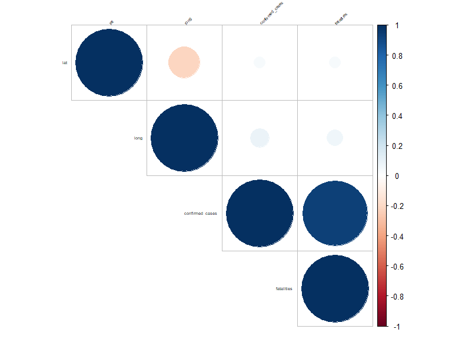

p8160\_project3\_jsg
================
Jared Garfinkel
4/21/2020

``` r
df = read_csv("./covid19-1.csv") %>% 
  janitor::clean_names() %>% 
  mutate(province_state = factor(province_state),
         country_region = factor(country_region),
         date = as.Date(date, "%m/%d/%y"))
```

    ## Parsed with column specification:
    ## cols(
    ##   Id = col_double(),
    ##   `Province/State` = col_character(),
    ##   `Country/Region` = col_character(),
    ##   Lat = col_double(),
    ##   Long = col_double(),
    ##   Date = col_character(),
    ##   ConfirmedCases = col_double(),
    ##   Fatalities = col_double()
    ## )

``` r
df_raw = df %>% 
  dplyr::select(lat, long, confirmed_cases, fatalities)
```

``` r
# correlation matrix
res <- round(cor(df_raw) %>% as.matrix(), 2)
corrplot(res, type = "upper", order = "hclust", 
         tl.col = "black", tl.srt = 45, tl.cex = 0.45)
```


